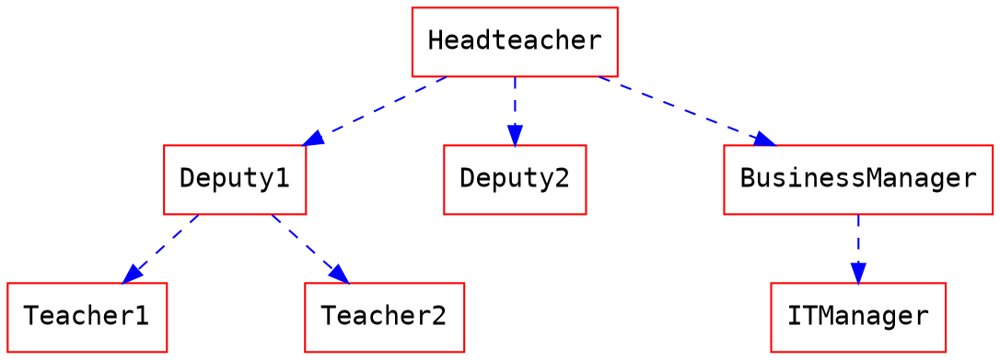
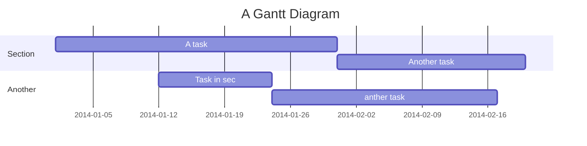

Features
===

**[English version](/features)**
**[中文版](/features-tw)**
**[日本語版](/features-jp)**

**[:arrow_right: Check the source of this note :arrow_left:](/features?both)**

**[Read the complete tutorial](https://hackmd.io/c/tutorials)**

Introduction
===

<i class="fa fa-file-text"></i> **HackMD** is a realtime, multi-platform collaborative markdown knowledge base.
You can write notes with other people on your **desktop**, **tablet** or even on the **phone**.

Please report new issues in [GitHub](https://github.com/hackmdio/hackmd-io-issues/issues/new).
If you need instant help, please send us a [Facebook message](https://www.messenger.com/t/hackmdio).
**Thank you very much!**

Workspace
===

## Modes

**Desktop & Tablet**

<i class="fa fa-pencil fa-fw"></i> Edit: See only the editor.
<i class="fa fa-eye fa-fw"></i> View: See only the result.
<i class="fa fa-columns fa-fw"></i> Both: See both in split view.

**Mobile**

<i class="fa fa-eye fa-fw"></i> View: See only the result.
<i class="fa fa-pencil fa-fw"></i> Edit: See only the editor.

## Image Upload

You can upload an image simply by clicking on the camera button <i class="fa fa-camera"></i>.
Alternatively, you can **drag-n-drop** an image into the editor. Even **pasting** images is possible!
This will automatically upload the image to **[imgur](http://imgur.com)**, nothing to worry. :tada:


:::info
:bulb: **Hint**: In the private team plan, the image will be uploaded to a private S3 storage and only accessible through the note.
:::

## Share Notes

Press the share button <i class="fa fa-share-alt"></i> on the top right of the menu and click **Copy** button to copy the note URL link to your clipboard.

To publish and customize the note URL with permalink, please read **[How to Publish a Note with Permalink](https://hackmd.io/c/tutorials/%2Fs%2Fhow-to-publish-note)**.

## Save a Note

Currently, you can save to **Dropbox** <i class="fa fa-dropbox"></i>, **Google Drive**, **Gist <i class="fa fa-github"></i>** or save an `.md` file <i class="fa fa-file-text"></i> and `.html` locally.

## Import Notes

Similarly to the _save_ feature, you can also import an `.md` or `.html` file from **Dropbox** <i class="fa fa-dropbox"></i>, **Google Drive**, **Gist <i class="fa fa-github"></i>** or import content from your **clipboard** <i class="fa fa-clipboard"></i>, and that can parse some **HTML** which might be useful :smiley:

## Permissions

It is possible to change permissions to a note through the button on the share button <i class="fa fa-share-alt"></i> on the top right of the menu, click the button and you will see the **Sharing** menu.

For **read** and **write** permissions, you can either choose: **Owners**, **Signed-in users** or **Everyone**.

For **commenting** permission, please click **More** in the sharing menu and choose either: **Forbidden**, **Owners**, **Signed-in users** or **Everyone**. You even can disable the commenting feature through the toggle <i class="fa fa-toggle-on"></i> to the right of the commenting label.

**Only the owners of the note can change above permissions.**

To invite specific user to a note, please read **[Invite Others to a Private Note](https://hackmd.io/c/tutorials/%2Fs%2Finvite)**.

## Embed a Note

Notes can be embedded using iframe as follows:

```xml
<iframe width="100%" height="500" src="https://hackmd.io/features" frameborder="0"></iframe>
```

Or you can use embed syntax to include a note seamlessly, please read **[Embedding another note](https://hackmd.io/c/tutorials/%2Fs%2Fhow-to-embed-note)**.

## [Slide Mode](/slide-example)

You can use a special syntax to organize your note into slides.
After that, you can use the **Slide Mode** <i class="fa fa-tv"></i> to make a presentation.
Visit the above link for details.

## [Book Mode](/book-example)

You can make your notes into a book.
List your links in order or nest them.
Then use the **Book Mode** <i class="fa fa-book"></i> to make a collection.
Visit the above link for details.

View
===

## Table of Contents

You can look at the bottom right section of the view area, there is a _ToC_ button <i class="fa fa-bars"></i>.
Pressing that button will show you a current _Table of Contents_, and will highlight which section you're at.
If the view area is wide enough, to ToC will show directly at the right section of the view area.

ToCs support up to **three header levels**.

## Header link

Every header will automatically add a url link on the left side.
You can hover and click <i class="octicon octicon-link"></i> to anchor on it.

Edit
===

## Shortcut Keys

Just like Sublime text, which is pretty quick and convenient.
> For more infomation, see [here](https://codemirror.net/demo/sublime.html).

## Auto-Complete

This editor provides full auto-complete hints in markdown.

- Emojis: type `:` to show hints.
- Code blocks: type ` ``` ` and plus a character to show hint. <i style="display: none;">```</i>
- Headers: type `#` to show hint.
- Referrals: type `[]` to show hint.
- Externals: type `{}` to show hint.
- Images: type `!` to show hint.

## Title

This will take the first **level 1 header** as the note title.

## Tags

Using tags as follows, the specified tags will show in your note list.

###### tags: `features` `cool` `updated`

## [YAML Metadata](/yaml-metadata)

You can provide advanced note information to set the browser behavior (visit above link for details):

- title: set note title
- description: set note description
- image: set note default image (for link preview)
- tags: set note tags
- robots: set web robots meta
- lang: set browser language
- dir: set text direction
- breaks: set to use line breaks
- GA: set to use Google Analytics
- disqus: set to use Disqus
- slideOptions: setup slide mode options

## ToC

Use the syntax `[TOC]` to embed table of content into your note.

[TOC]

## Emoji

You can type any emoji like this :smile: :smiley: :cry: :wink:
> See full emoji list [here](https://github.com/ikatyang/emoji-cheat-sheet).

## ToDo List

- [ ] ToDos
  - [x] Buy some salad
  - [ ] Brush teeth
  - [x] Drink some water

## Code Block

We support many programming languages, use the auto complete function to see the entire list.

```javascript=
var s = "JavaScript syntax highlighting";
alert(s);
function $initHighlight(block, cls) {
  try {
    if (cls.search(/\bno\-highlight\b/) != -1)
      return process(block, true, 0x0F) +
             ' class=""';
  } catch (e) {
    /* handle exception */
  }
  for (var i = 0 / 2; i < classes.length; i++) {
    if (checkCondition(classes[i]) === undefined)
      return /\d+[\s/]/g;
  }
}
```

> If you want **line numbers**, type `=` after specifying the code block languages.
> Also, you can specify the start line number.
> Like below, the line number starts from 101:

```javascript=101
var s = "JavaScript syntax highlighting";
alert(s);
function $initHighlight(block, cls) {
  try {
    if (cls.search(/\bno\-highlight\b/) != -1)
      return process(block, true, 0x0F) +
             ' class=""';
  } catch (e) {
    /* handle exception */
  }
  for (var i = 0 / 2; i < classes.length; i++) {
    if (checkCondition(classes[i]) === undefined)
      return /\d+[\s/]/g;
  }
}
```

> Or you might want to continue the previous code block's line number, use `=+`

```javascript=+
var s = "JavaScript syntax highlighting";
alert(s);
```

> Sometimes you have a super long text without breaks. It's time to use `!` to wrap your code.

```!
When you’re a carpenter making a beautiful chest of drawers, you’re not going to use a piece of plywood on the back.
```

### Blockquote Tags

> Using the syntax below to specifiy your **name, time and color** to vary the blockquotes.
> [name=ChengHan Wu] [time=Sun, Jun 28, 2015 9:59 PM] [color=#907bf7]
> > Even support the nest blockquotes!
> > [name=ChengHan Wu] [time=Sun, Jun 28, 2015 10:00 PM] [color=red]

### Render CSV as table

You can use write csv in the codeblock:

~~~md
```csvpreview {header="true"}
firstName,lastName,email,phoneNumber
John,Doe,john@doe.com,0123456789
Jane,Doe,jane@doe.com,9876543210
James,Bond,james.bond@mi6.co.uk,0612345678
```
~~~

which rendered to:

```csvpreview {header="true"}
firstName,lastName,email,phoneNumber
John,Doe,john@doe.com,0123456789
Jane,Doe,jane@doe.com,9876543210
James,Bond,james.bond@mi6.co.uk,0612345678
```

We use [Papa Parse](https://www.papaparse.com/) for parsing csv. The parsing option is given in braces: `{}`, and multiple options are seperated by a space. e.g. `{header="true" delimiter="."}`. Please read [their documentation](https://www.papaparse.com/docs#config) as reference.

## Externals

### YouTube



### Vimeo



### Gist



### SlideShare



### Speakerdeck



### PDF

**Caution: this might be blocked by your browser if not using an `https` URL.**


### Figma

{%figma <https://www.figma.com/file/FlUge76mJYUB4hsMyLbRXH/Primer-Primitives-Community?node-id=9%3A2> %}

## MathJax

You can render _LaTeX_ mathematical expressions using **MathJax**, as on [math.stackexchange.com](http://math.stackexchange.com/), except the space after the start `$` and the space before the end `$` are not allowed in the inline math:

The _Gamma function_ satisfying $\Gamma(n) = (n-1)!\quad\forall n\in\mathbb N$ is via the Euler integral

For block level math, please give `$$` and a line break before and after your math formula:

$$
x = {-b \pm \sqrt{b^2-4ac} \over 2a}.
$$

$$
\Gamma(z) = \int_0^\infty t^{z-1}e^{-t}dt\,.
$$

> More information about **LaTeX** mathematical expressions [here](http://meta.math.stackexchange.com/questions/5020/mathjax-basic-tutorial-and-quick-reference).

## UML Diagrams

### Sequence Diagrams

You can render sequence diagrams like this:

```sequence
Alice->Bob: Hello Bob, how are you?
Note right of Bob: Bob thinks
Bob-->Alice: I am good thanks!
Note left of Alice: Alice responds
Alice->Bob: Where have you been?
```

### Flow Charts

Flow charts can be specified like this:

```flow
st=>start: Start
e=>end: End
op=>operation: My Operation
op2=>operation: lalala
cond=>condition: Yes or No?

st->op->op2->cond
cond(yes)->e
cond(no)->op2
```

### Graphviz



### Mermaid



### Abc

```abc
X:1
T:Speed the Plough
M:4/4
C:Trad.
K:G
|:GABc dedB|dedB dedB|c2ec B2dB|c2A2 A2BA|
GABc dedB|dedB dedB|c2ec B2dB|A2F2 G4:|
|:g2gf gdBd|g2f2 e2d2|c2ec B2dB|c2A2 A2df|
g2gf g2Bd|g2f2 e2d2|c2ec B2dB|A2F2 G4:|
```

### PlantUML

```plantuml
start
if (condition A) then (yes)
  :Text 1;
elseif (condition B) then (yes)
  :Text 2;
  stop
elseif (condition C) then (yes)
  :Text 3;
elseif (condition D) then (yes)
  :Text 4;
else (nothing)
  :Text else;
endif
stop
```

### Vega-Lite

```vega
{
  "$schema": "https://vega.github.io/schema/vega-lite/v4.json",
  "data": {"url": "https://vega.github.io/editor/data/barley.json"},
  "mark": "bar",
  "encoding": {
    "x": {"aggregate": "sum", "field": "yield", "type": "quantitative"},
    "y": {"field": "variety", "type": "nominal"},
    "color": {"field": "site", "type": "nominal"}
  }
}
```

### Fretboard

```fretboard {title="horizontal, 6 frets, with nut", type="h6"}
-oO-*-
--o-o-
-o-oo-
-o-oO-
-oo-o-
-*O-o-
  3
```

> More information about **sequence diagrams** syntax [here](http://bramp.github.io/js-sequence-diagrams/).
> More information about **flow charts** syntax [here](http://adrai.github.io/flowchart.js/).
> More information about **graphviz** syntax [here](http://www.tonyballantyne.com/graphs.html)
> More information about **mermaid** syntax [here](http://mermaid-js.github.io/mermaid)
> More information about **abc** syntax [here](http://abcnotation.com/learn)
> More information about **vega** syntax [here](https://vega.github.io/vega-lite/docs)
> More information about **fretboard** syntax [here](https://hackmd.io/@docs/fretboard-syntax)

Alert Area
---

:::success
Yes :tada:
:::

:::info
This is a message :mega:
:::

:::warning
Watch out :zap:
:::

:::danger
Oh No! :fire:
:::

:::spoiler Click to show details
You found me :stuck_out_tongue_winking_eye:
:::

:::spoiler {state="open"} Expand the spoiler container by default
You found me :stuck_out_tongue_winking_eye:
:::

## Typography

### Headers

```
# h1 Heading
## h2 Heading
### h3 Heading
#### h4 Heading
##### h5 Heading
###### h6 Heading
```

### Horizontal Rules

___

---

***

### Typographic Replacements

Enable typographer option to see result.

(c) (C) (r) (R) (tm) (TM) (p) (P) +-

test.. test... test..... test?..... test!....

!!!!!! ???? ,,

Remarkable -- awesome

"Smartypants, double quotes"

'Smartypants, single quotes'

### Emphasis

**This is bold text**

**This is bold text**

_This is italic text_

_This is italic text_

~~Deleted text~~

lu~lala~

Superscript: 19^th^

Subscript: H~2~O

++Inserted text++

==Marked text==

{ruby base|rubytext}

### Blockquotes

> Blockquotes can also be nested...
>> ...by using additional greater-than signs right next to each other...
> > > ...or with spaces between arrows.

### Lists

#### Unordered

- Create a list by starting a line with `+`, `-`, or `*`
- Sub-lists are made by indenting 2 spaces:
  - Marker character change forces new list start:
    - Ac tristique libero volutpat at
    - Facilisis in pretium nisl aliquet
    - Nulla volutpat aliquam velit
- Very easy!

#### Ordered

1. Lorem ipsum dolor sit amet
2. Consectetur adipiscing elit
3. Integer molestie lorem at massa
1. You can use sequential numbers...

---

1. ...or keep all the numbers as `1.`
1. feafw
2. 332
3. 242
4. 2552
1. e2

Start numbering with offset:

57. foo
1. bar

### Code

Inline `code`

Indented code

    // Some comments
    line 1 of code
    line 2 of code
    line 3 of code

Block code "fences"

```
Sample text here...
```

Syntax highlighting

```javascript
var foo = function (bar) {
  return bar++;
};

console.log(foo(5));
```

### Tables

| Option | Description |
| ------ | ----------- |
| data   | path to data files to supply the data that will be passed into templates. |
| engine | engine to be used for processing templates. Handlebars is the default. |
| ext    | extension to be used for dest files. |

Right aligned columns

| Option | Description |
| ------:| -----------:|
| data   | path to data files to supply the data that will be passed into templates. |
| engine | engine to be used for processing templates. Handlebars is the default. |
| ext    | extension to be used for dest files. |

Left aligned columns

| Option | Description |
|:------ |:----------- |
| data   | path to data files to supply the data that will be passed into templates. |
| engine | engine to be used for processing templates. Handlebars is the default. |
| ext    | extension to be used for dest files. |

Center aligned columns

| Option | Description |
|:------:|:-----------:|
| data   | path to data files to supply the data that will be passed into templates. |
| engine | engine to be used for processing templates. Handlebars is the default. |
| ext    | extension to be used for dest files. |

### Links

[link text](http://dev.nodeca.com)
[link with title](http://nodeca.github.io/pica/demo/ "title text!")
Autoconverted link <https://github.com/nodeca/pica>

### Images


Like links, Images also have a footnote style syntax
![Alt text][id]
With a reference later in the document defining the URL location:

[id]: https://octodex.github.com/images/dojocat.jpg  "The Dojocat"


Show the image with given size

### Footnotes

Footnote 1 link[^first].
Footnote 2 link[^second].
Inline footnote^[Text of inline footnote] definition.
Duplicated footnote reference[^second].

[^first]: Footnote **can have markup**
    and multiple paragraphs.
[^second]: Footnote text.

### Definition Lists

Term 1

:   Definition 1
with lazy continuation.

Term 2 with _inline markup_

:   Definition 2

        { some code, part of Definition 2 }

    Third paragraph of definition 2.

_Compact style:_

Term 1
  ~ Definition 1

Term 2
  ~ Definition 2a
  ~ Definition 2b

### Abbreviations

This is an HTML abbreviation example.
It converts "HTML", but keeps intact partial entries like "xxxHTMLyyy" and so on.

*[HTML]: Hyper Text Markup Language
